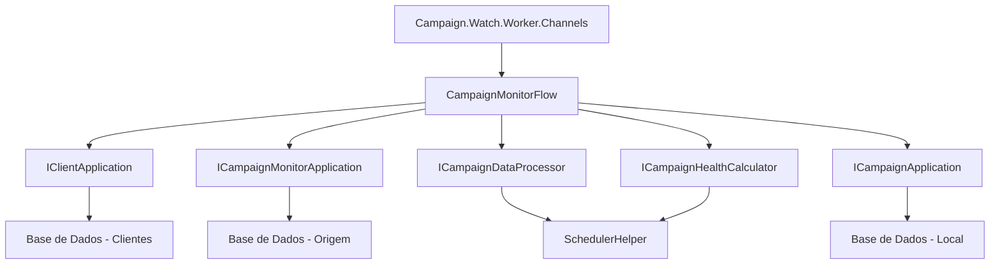
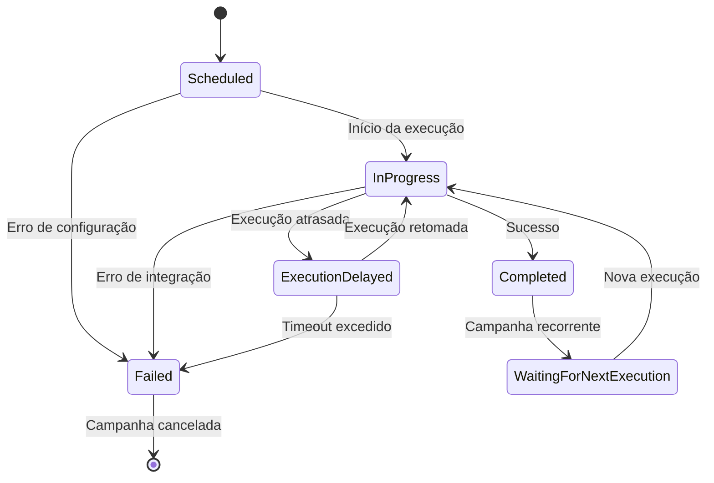

# Worker de Validação de Campanhas - Documentação

## Visão Geral

O **Campaign Watch Worker** é um sistema de monitoramento responsável por validar e acompanhar o status de campanhas de marketing. Ele verifica execuções, detecta problemas, calcula métricas de saúde e mantém um banco de dados atualizado com o estado atual das campanhas.

## Arquitetura do Sistema

### Componentes Principais



## Fluxo Principal de Execução

### 1. Inicialização do Worker

O worker é iniciado como um serviço em background que executa em intervalos configurados:

```json
{
  "WorkerSettings": {
    "Enabled": true,
    "ExecutionIntervalMinutes": 1,
    "MaxRetryAttempts": 3,
    "RetryDelaySeconds": 30,
    "HealthCheckIntervalMinutes": 15
  }
}
```

### 2. Processo de Monitoramento (`MonitorarCampanhasAsync`)

#### 2.1 Busca de Clientes Ativos
- Recupera todos os clientes cadastrados
- Filtra apenas os clientes ativos (`IsActive = true`)
- Para cada cliente ativo, inicia o processamento das campanhas

#### 2.2 Processamento por Cliente (`ProcessarCampanhasDoClienteAsync`)
1. **Validação**: Verifica se o cliente possui configuração de banco de dados
2. **Busca na Origem**: Recupera campanhas da base de dados original do cliente
3. **Processamento Individual**: Para cada campanha encontrada, executa o fluxo completo

### 3. Processamento de Campanha Individual (`ProcessarCampanhaUnicaAsync`)

#### 3.1 Enriquecimento de Dados (`ICampaignDataProcessor`)
- **Mapeamento Inicial**: Converte dados da origem para entidade local
- **Busca de Execuções**: Recupera execuções da campanha na base original
- **Detecção de Execuções Faltantes**: Identifica execuções que deveriam existir mas não foram encontradas
- **Enriquecimento de Steps**: Adiciona dados de integração para cada step de canal

#### 3.2 Cálculo de Saúde (`ICampaignHealthCalculator`)
- **Determinação do Tipo**: Identifica se é campanha única ou recorrente
- **Próxima Execução**: Calcula quando deve ser a próxima execução (para recorrentes)
- **Status de Saúde**: Avalia problemas de integração e execuções pendentes
- **Status de Monitoramento**: Define o status geral da campanha

#### 3.3 Persistência
- **Verificação de Existência**: Checa se a campanha já existe localmente
- **Criação ou Atualização**: Decide se cria nova entrada ou atualiza existente

## Detalhamento dos Componentes

### CampaignDataProcessor

Responsável pelo processamento e enriquecimento dos dados das campanhas:

#### Funcionalidades Principais:
1. **Verificação de Execuções Faltantes**
   - Para campanhas recorrentes, compara execuções esperadas vs encontradas
   - Cria "execuções fantasma" para representar falhas de execução
   - Usa `SchedulerHelper` para calcular datas esperadas baseadas no crontab

2. **Enriquecimento de Steps de Canal**
   - Identifica steps do tipo "Channel"
   - Busca configurações de canal no cliente
   - Adiciona dados de integração específicos por tipo de canal

#### Tipos de Canal Suportados:
- **EffectiveMail**: Campanhas de email
- **EffectiveSms**: Campanhas de SMS  
- **EffectivePush**: Notificações push
- **EffectiveApi**: Integrações via API
- **EffectivePages**: Landing pages
- **EffectiveSocial**: Redes sociais
- **EffectiveWhatsApp**: WhatsApp Business

### CampaignHealthCalculator

Calcula métricas de saúde e determina o status de monitoramento:

#### Tipos de Campanha:
- **Single**: Campanha única, execução pontual
- **Recurrent**: Campanha recorrente, múltiplas execuções agendadas

#### Status de Monitoramento:
- **Pending**: Aguardando início
- **InProgress**: Em execução
- **Completed**: Concluída com sucesso
- **Failed**: Falhou por erro de integração
- **ExecutionDelayed**: Execução atrasada
- **WaitingForNextExecution**: Aguardando próxima execução (recorrentes)

#### Métricas de Saúde:
```csharp
public class MonitoringHealthStatus
{
    public bool IsFullyVerified { get; set; }
    public bool HasPendingExecution { get; set; }
    public bool HasIntegrationErrors { get; set; }
    public string LastExecutionWithIssueId { get; set; }
    public string LastMessage { get; set; }
}
```

### SchedulerHelper

Utilitário para trabalhar com expressões crontab:

#### Funcionalidades:
- **Validação**: Verifica se expressão crontab é válida
- **Próxima Execução**: Calcula próxima data de execução
- **Múltiplas Execuções**: Gera lista de próximas execuções
- **Todas as Ocorrências**: Lista execuções em um intervalo
- **Verificação de Atraso**: Determina se execução está atrasada

#### Normalização de Crontab:
- Converte formatos de 6-7 campos para 5 campos padrão
- Remove campos de segundos e anos quando necessário
- Substitui caracteres incompatíveis (como '?') por '*'

## Tratamento de Erros e Recuperação

### Níveis de Erro:

#### 1. Erro por Cliente
- Log de erro e continuação para próximo cliente
- Não interrompe processamento geral

#### 2. Erro por Campanha
- Log de erro e continuação para próxima campanha
- Não afeta outras campanhas do mesmo cliente

#### 3. Erro Fatal
- Interrompe todo o ciclo de monitoramento
- Requer intervenção manual

### Execuções Faltantes

Quando uma campanha recorrente deveria ter executado mas não foi encontrada execução:
- Cria "execução fantasma" com status `MissingInSource`
- Adiciona step de monitoramento explicando o problema
- Marca como erro de monitoramento para alertas

## Configurações e Parâmetros

### Configurações do Worker
```json
{
  "MonitoringSettings": {
    "CampaignBatchSize": 50,
    "MaxConcurrentClients": 3,
    "DelayedExecutionThresholdMinutes": 15,
    "EnableDetailedLogging": false
  }
}
```

### Variáveis de Ambiente
- `CONN_STRING_VAULT`: URL do cofre de senhas
- `USER_VAULT`: Usuário para acesso ao cofre
- `PASS_VAULT`: Senha para acesso ao cofre
- `ASPNETCORE_ENVIRONMENT`: Ambiente de execução

## Logs e Monitoramento

### Níveis de Log:
- **Information**: Fluxo normal de execução
- **Warning**: Problemas não críticos (execuções faltantes)
- **Error**: Falhas por cliente/campanha
- **Critical**: Erros fatais que interrompem o sistema

### Métricas Importantes:
- Total de campanhas processadas por ciclo
- Número de clientes com erro
- Tempo de execução do ciclo completo
- Taxa de campanhas com problemas de saúde

## Dependências e Integrações

### Bancos de Dados:
1. **Banco Local**: Armazena campanhas processadas e status
2. **Banco de Origem**: Base original das campanhas (por cliente)
3. **Bancos de Canal**: Bases específicas de cada canal de integração

### Bibliotecas Principais:
- **AutoMapper**: Mapeamento entre DTOs e entidades
- **MongoDB.Bson**: Manipulação de documentos MongoDB
- **NCrontab**: Processamento de expressões crontab
- **Microsoft.Extensions**: Injeção de dependência e hosting

## Fluxo de Estados da Campanha



## Considerações de Performance

### Otimizações Implementadas:
- Processamento assíncrono por cliente
- Verificação de necessidade de atualização antes de persistir
- Cache de configurações de cliente durante processamento
- Uso de HashSet para busca rápida de execuções

### Limitações Atuais:
- Processamento sequencial de campanhas por cliente
- Sem cache entre ciclos de execução
- Dependência de disponibilidade de todas as bases de origem

## Próximos Passos e Melhorias

1. **Implementação de Cache**: Redis para configurações e dados temporários
2. **Processamento Paralelo**: Campanhas em paralelo por cliente
3. **Métricas Avançadas**: Dashboard de monitoramento em tempo real
4. **Alertas Automatizados**: Notificações para problemas críticos
5. **Retry Inteligente**: Tentativas específicas por tipo de erro
6. **Health Checks**: Endpoint para verificação de saúde do worker